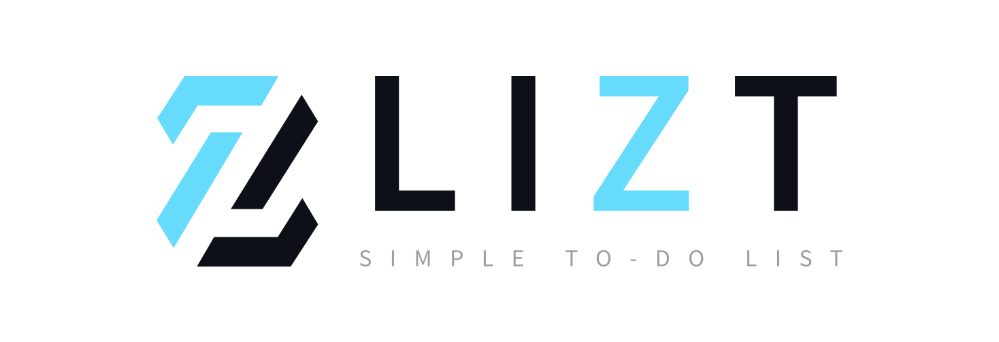
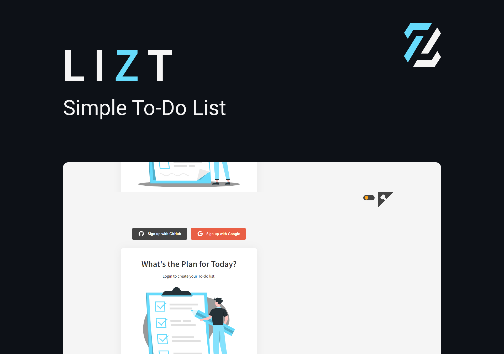

<p align="center">
  
</p>

<p align="center">
    
</p>

## 🧪 Technologies

This project was developed using the following technologies:

- [React](https://reactjs.org)
- [Next.js](https://nextjs.org/)
- [TypeScript](https://www.typescriptlang.org/)
- [SCSS](https://sass-lang.com/)
- [Firebase](https://firebase.google.com/)

## 📚 Libs

Main libraries used in the application:

- [react-github-corner](https://github.com/skratchdot/react-github-corner)
- [react-toastify](https://www.npmjs.com/package/react-toastify/)
- [styled-components](https://styled-components.com/)
- [react-device-detect](https://www.npmjs.com/package/react-device-detect)

## 🔥 Preview

The easiest way to deploy your Next.js app is to use the [Vercel Platform](https://vercel.com/new?utm_medium=default-template&filter=next.js&utm_source=create-next-app&utm_campaign=create-next-app-readme) from the creators of Next.js.

[](https://lizt-next.vercel.app/)

## 🚀 Getting started

Clone the project and access the folder.

```bash
$ git clone https://github.com/jneris-dev/lizt.git
$ cd lizt
```

Follow the steps below:
```bash
# Install the dependencies
$ yarn

# Start the project
$ yarn dev
```
The app will be available for access on your browser at http://localhost:3000

## 💻 Project

[Lizt](https://lizt-next.vercel.app/) is a simple to-do list tool with firebase login and authentication. 📝

## 📝 License

This project is licensed under the MIT License. See the [LICENSE](LICENSE) file for details.


---

<p align="center">Made with 🖤 by João Neris</p>
